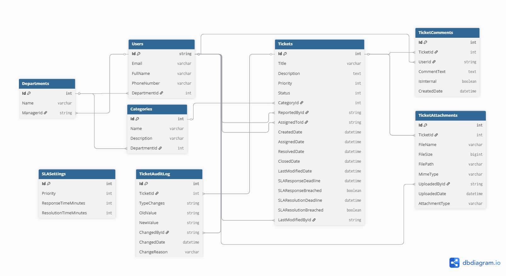
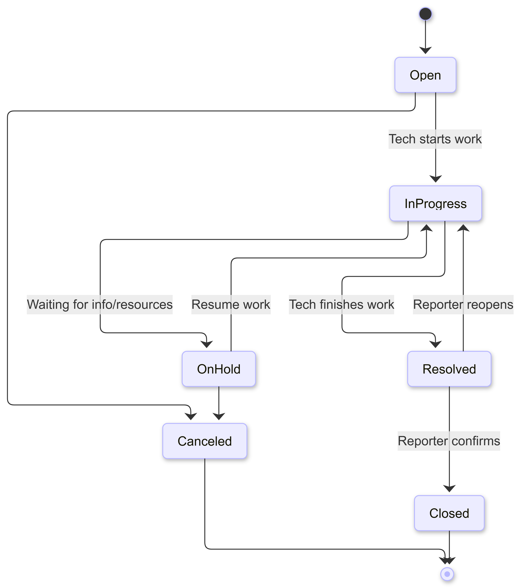

# DeskFlow — Help Desk Ticket Management System

A production-ready RESTful API for managing IT support tickets, built with **ASP.NET Core** and following clean architecture principles.

---

## Overview

DeskFlow is a full-featured help desk system that enables organizations to track, assign, and resolve support tickets across departments. It supports role-based access control, SLA monitoring, email notifications, and a complete audit trail for every ticket action.

---

## Features

- **JWT Authentication** with refresh token rotation
- **Role-Based Access Control** — Admin, Manager, Technician, User
- **Ticket Lifecycle Management** — status transitions enforced by business rules per role
- **SLA Tracking** — automatic breach detection with hourly background jobs
- **Audit History** — every ticket change is logged with who made it and why
- **File Attachments** — upload/download files per ticket with type and size validation
- **Email Notifications** — triggered on ticket creation, assignment, resolution, and SLA breaches via background queue (Hangfire)
- **Pagination & Filtering** — on tickets and users
- **Swagger UI** — full API documentation with XML comments

---

## Tech Stack

| Layer | Technology |
|---|---|
| Framework | ASP.NET Core 10 |
| ORM | Entity Framework Core 10 |
| Database | SQL Server |
| Authentication | JWT Bearer + Refresh Tokens |
| Authorization | ASP.NET Core Policy-Based Auth |
| Background Jobs | Hangfire |
| Email | MailKit (SMTP) |
| Testing | xUnit, Moq, FluentAssertions, AutoFixture |
| API Docs | Swagger / OpenAPI |

---

## Architecture

The solution follows **Clean Architecture** with three layers:

```
DeskFlow.Core           → Domain entities, DTOs, service contracts, business rules
DeskFlow.Infrastructure → EF Core repositories, email sender, file storage, Hangfire
DeskFlow.WebAPI         → Controllers, middleware, authorization handlers, DI wiring
DeskFlow.Tests          → Unit tests (services) + Integration tests (controllers)
```

---

## Diagrams

### Entity Relationship Diagram


### Ticket State Machine


## Permissions Matrix

| Action | Admin | Manager | Technician | User |
|---|:---:|:---:|:---:|:---:|
| Create/Delete/Edit Users | ✅ | ❌ | ❌ | ❌ |
| Create Ticket | ✅ | ✅ | ✅ | ✅ |
| Delete Ticket | ✅ | ❌ | ❌ | ❌ |
| View Ticket | All | Dept only | Assigned only | Own only |
| Update Status | ❌ | ✅ | ✅ | ❌ |
| Update Priority | ❌ | ✅ | ❌ | ❌ |
| Assign Technician | ❌ | ✅ | Self only | ❌ |
| Manage Departments/SLA | ✅ | ❌ | ❌ | ❌ |

---

## Getting Started

### Prerequisites

- .NET 10 SDK
- SQL Server

### Setup

```bash
# Clone the repository
git clone https://github.com/your-username/DeskFlow.git
cd DeskFlow

# Set your connection string and JWT secret in user secrets
dotnet user-secrets set "connectionStrings:DefaultConnection" "your_connection_string" --project DeskFlow.WebAPI
dotnet user-secrets set "Jwt:SecretKey" "your_secret_key" --project DeskFlow.WebAPI

# Apply migrations
dotnet ef database update --project DeskFlow.Infrastructure --startup-project DeskFlow.WebAPI

# Run the API
dotnet run --project DeskFlow.WebAPI
```

Swagger UI will be available at `https://localhost:7155/swagger`.

---

## Running Tests

```bash
dotnet test
```

The test suite includes:

- **Unit Tests** — `TicketService`, `UserService`, `JwtService` with mocked dependencies
- **Integration Tests** — Controller-level tests using an in-memory database and a custom `TestAuthHandler` to simulate roles without real JWT tokens

---

## API Highlights

| Method | Endpoint | Description |
|---|---|---|
| `POST` | `/api/auth/login` | Login and receive JWT + refresh token |
| `POST` | `/api/auth/refresh-token` | Rotate tokens |
| `POST` | `/api/tickets` | Open a new ticket |
| `GET` | `/api/tickets/{id}` | Get ticket details |
| `PATCH` | `/api/tickets/{id}/status` | Update ticket status |
| `PATCH` | `/api/tickets/{id}/assign` | Assign technician |
| `GET` | `/api/tickets/{id}/history` | View audit log |
| `POST` | `/api/tickets/{id}/attachments` | Upload file |
| `GET` | `/api/tickets/{id}/comments` | Get comments |

---

## License

This project is for portfolio and educational purposes.